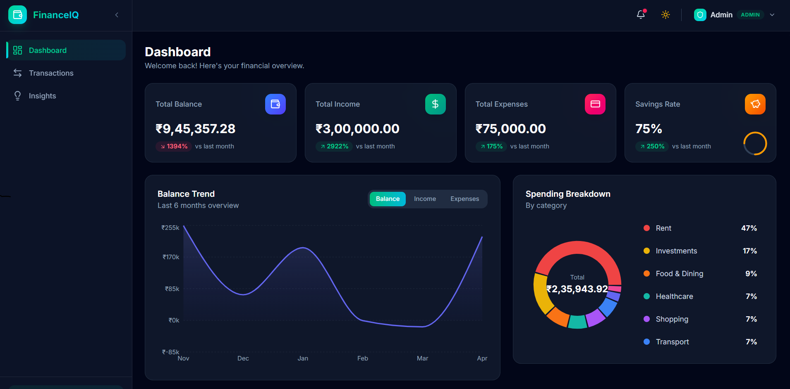

# FinanceIQ — Smart Finance Dashboard

A modern, interactive finance dashboard frontend application featuring dynamic charts, role-based access control, smart insights, and fully functional filtering. Built with React (Next.js 16), TypeScript, Tailwind CSS v4, Recharts, and Zustand — focusing on a fast, responsive, and data-rich user experience.



## 🚀 Setup Instructions

```bash
# Clone the repository
git clone <repo-url>

# Install dependencies
npm install

# Start development server
npm run dev

# Build for production
npm run build
```

The app runs at `http://localhost:3000/`.

## 🏗️ Architecture & Key Decisions

### State Management: Zustand

**Why Zustand over Context + useReducer:**

1. **No Provider wrapper** — Zustand stores are standalone; no need to wrap the entire app in a context provider tree.
2. **Built-in selectors** — Components only re-render when the specific slice of state they subscribe to changes (e.g., `useStore(s => s.role)` won't re-render the entire dashboard when transactions change).
3. **Minimal boilerplate** — A single `create()` call defines the entire store, avoiding separate reducer, actions, context, and provider files.
4. **Built-in Persist Middleware** — Zustand natively supports persisting state (like dark mode, roles, and user transactions) seamlessly into `localStorage`.

### Project Structure

```
src/
├── app/            # Next.js App Router setup & layouts
├── types/          # TypeScript interfaces (Transaction, Filters, UserRole)
├── data/           # Seed data generator (Mock transactions)
├── store/          # Zustand store (single source of truth & slice patterns)
├── hooks/          # Custom hooks (dashboard metrics, filtered lists, insights)
├── lib/            # Utilities (calculators, formatters, export)
└── components/
    ├── ui/         # Reusable components (Skeletons, badges, buttons)
    ├── layout/     # Sidebar, navbar, role switcher
    ├── dashboard/  # Summary cards, recent transactions 
    ├── charts/     # Recharts integrations (Balance trend, breakdown)
    ├── insights/   # Insight grid cards
    └── transactions/ # Transaction table and forms
```

## 🎯 Architecture Implementations

### Client Component Strategy
While Next.js App Router heavily relies on React Server Components, this application treats dashboards, charts, and interactive tables as dense client boundaries. By opting for `'use client'` at the page level, we simplify the integration of interactive chart libraries, state management, and continuous filter changes without excessive server boundary crossing.

### Hydration Guard Implementation
Because Zustand's `persist` middleware hydrates from `localStorage` directly on the client, standard Next.js rendering often hits hydration mismatch errors (server output differing from client stored state). A custom `HydrationGuard` component acts as a wrapper, suspending rendering and showing a skeleton loader until hydration guarantees match before rendering.

## ✅ Implemented Features

### Core
- **Dashboard Overview** — Summary cards (Balance, Income, Expenses, Savings Rate) with trend indicators that exclude pending/failed transactions.
- **Balance Trend Chart** — 13-month area chart with toggle between Balance/Income/Expenses.
- **Spending Breakdown** — Interactive donut chart with category legend.
- **Recent Transactions** — Last 5 transactions with quick "View All" link.
- **Transaction Table** — Full sortable, filterable, searchable transaction list.
- **Pagination** — 10 items per page with functional page controls.
- **Insights Page** — 7+ insight cards with data-driven observations.
- **Dynamic Notifications** — Relative-time notifications when adding new transactions.

### Role-Based UI (RBAC)
- **Role Switcher** — Toggle between Viewer and Admin via navbar dropdown.
- **Viewer Mode** — Read-only access, action buttons hidden.
- **Admin Mode** — Full CRUD: Add, Edit (status toggle), Delete transactions.
- **Toast Notifications** — Visual feedback when switching roles.
- **Role Badge** — Color-coded badge showing current role.

### Filtering & Search
- **Full-text Search** — Search across merchants and descriptions.
- **Date Range Filter** — From/To date pickers.
- **Category Filter** — Multi-select category chips.
- **Type Filter** — All / Income / Expense.
- **Status Filter** — All / Completed / Pending / Failed.
- **Clear All Filters** — One-click filter reset.
- **Empty State** — Clean UI when no results match filters.

### Enhancements
- **Dark / Light Mode** — Toggle with persistence to localStorage.
- **CSV Export** — Admin-only filtered transaction export.
- **Add Transaction Modal** — Zod-validated form with all fields.
- **Delete Confirmation** — Modal confirmation before deleting.
- **Skeleton Loaders** — Simulated loading with pulse animations.
- **Framer Motion Animations** — Page transitions, card hover effects, list entrance.

## 📊 Mock Data & Feature Improvements

### Mock Data Strategy
The app generates over 60 realistic transactions spanning 13 months with:
- **10 Categories**: Food & Dining, Transport, Shopping, Entertainment, Healthcare, Utilities, Salary, Freelance, Investments, Rent.
- **Distribution**: ~70% expenses, ~30% income.
- **Statuses**: Completed (82%), Pending (10%), Failed (8%).
- **Realistic Merchants**: Starbucks, Amazon, Uber, Netflix, etc.

*Data simulates regeneration on page reload to demonstrate visual flexibilities across varying states.*

### Future Improvements
- **Real Backend API** — Extend Zustand fetch layers to connect with a Node.js/PostgreSQL backend instead of `localStorage`.
- **Full Inline Editing** — Expand the admin capabilities to edit text/amounts straight from the table instead of status-only toggles.
- **Budget Goals & Alerts** — Set custom budgets per category with progressive visual bars turning red when nearing limits.
- **Recurring Transactions** — Subscription timeline tracking and forward-looking balance projections.
- **Multi-currency Support** — Toggle base currencies dynamically formatting the dashboard visualizations.
